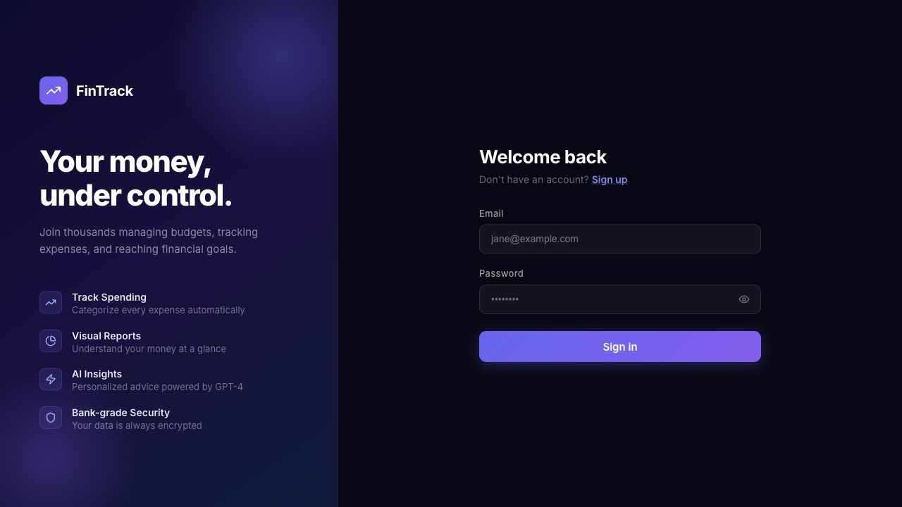
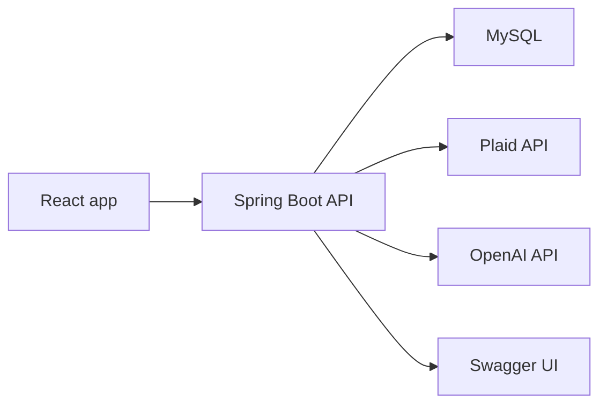

# FinTrack


FinTrack is a full-stack personal finance dashboard for tracking transactions, planning monthly budgets, connecting bank accounts through Plaid, and generating AI-assisted spending insights.



## Highlights

- Email and password authentication with JWT-protected API routes.
- Manual income and expense tracking with categories, notes, dates, and CSV export.
- Monthly budget limits with spending summaries, progress indicators, and budget status.
- Plaid Link integration for bank account connections and transaction sync.
- OpenAI-powered spending insights when an API key is configured.
- Swagger UI for exploring and testing the backend API.
- Docker Compose setup for local full-stack development.

## Tech Stack

| Layer | Tools |
| --- | --- |
| Frontend | React 18, TypeScript, Vite, React Router, Recharts, Lucide icons |
| Backend | Java 17, Spring Boot 3.2, Spring Security, Spring Data JPA, Bean Validation |
| Data | MySQL 8 in Docker, H2 for tests |
| Integrations | Plaid, OpenAI Chat Completions |
| DevOps | Docker, Docker Compose, Nginx frontend container |

## Architecture



## Quick Start

### 1. Configure environment variables

```bash
cp .env.example .env
```

Generate fresh values and place them in `.env`:

```bash
openssl rand -base64 48   # JWT_SECRET
openssl rand -base64 32   # PLAID_ENCRYPTION_KEY
```

OpenAI and Plaid credentials are optional for basic manual finance tracking. Leave them blank if you only want local auth, transactions, and budgets.

### 2. Run the app with Docker

```bash
docker compose up --build
```

The app will be available at:

| Service | URL |
| --- | --- |
| Frontend | http://localhost:3000 |
| Backend API | http://localhost:8080 |
| Swagger UI | http://localhost:8080/swagger-ui.html |
| Health check | http://localhost:8080/actuator/health |

## Local Development

Run the backend:

```bash
cd backend
mvn spring-boot:run -Dspring-boot.run.profiles=local
```

Run the frontend:

```bash
cd frontend
npm install
npm start
```

The Vite dev server runs at `http://localhost:5173` and proxies `/api` requests to the backend on `http://localhost:8080`.

## Environment Variables

| Variable | Required | Purpose |
| --- | --- | --- |
| `DB_HOST` | Docker | Database host. Use `db` inside Docker Compose and `127.0.0.1` for local MySQL. |
| `DB_USERNAME` | Yes | Database user. |
| `DB_PASSWORD` | Yes | Database password. |
| `JWT_SECRET` | Yes | HMAC signing secret for JWTs. Generate a long random value. |
| `OPENAI_API_KEY` | No | Enables AI spending insights. |
| `PLAID_CLIENT_ID` | No | Plaid client ID for bank connections. |
| `PLAID_SECRET` | No | Plaid secret for bank connections. |
| `PLAID_ENV` | No | Plaid environment, usually `sandbox`, `development`, or `production`. |
| `PLAID_WEBHOOK_URL` | No | Public webhook URL for Plaid transaction updates. |
| `PLAID_ENCRYPTION_KEY` | Yes | Base64 32-byte AES key for encrypting Plaid access tokens at rest. |
| `CORS_ORIGINS` | Yes | Comma-separated list of frontend origins allowed to call the API. |

## Security Notes

- Real secrets belong in `.env`, which is ignored by Git.
- `.env.example` is safe to commit because it only contains placeholders.
- Docker Compose requires `DB_PASSWORD`, `JWT_SECRET`, and `PLAID_ENCRYPTION_KEY` instead of silently using production-unsafe defaults.
- Plaid access tokens are encrypted at rest with AES-256-GCM.
- JWT and Plaid encryption configuration are validated when the backend starts.
- Production deployments should use HTTPS, managed secrets, restricted CORS origins, and a non-root database user.

## API Docs

When the backend is running, open Swagger UI:

```text
http://localhost:8080/swagger-ui.html
```

The raw OpenAPI document is available at:

```text
http://localhost:8080/api-docs
```

## Testing

Backend tests:

```bash
cd backend
mvn test
```

Frontend typecheck and production build:

```bash
cd frontend
npm run build
```

Dependency audit:

```bash
cd frontend
npm audit
```

## Project Structure

```text
fintrack/
+-- backend/              # Spring Boot API
|   +-- src/main/java/    # Controllers, services, repositories, security
|   +-- src/test/java/    # Backend unit and integration tests
+-- frontend/             # React + TypeScript app
|   +-- src/components/   # Reusable UI components
|   +-- src/hooks/        # Auth and client-side state hooks
|   +-- src/pages/        # Login and dashboard screens
|   +-- src/services/     # API client wrappers
+-- docs/screenshots/     # README screenshots
+-- docker-compose.yml    # Local full-stack runtime
+-- .env.example          # Safe environment template
+-- README.md
```

## Deployment Checklist

- Replace every value in `.env` with deployment-specific secrets.
- Use a dedicated database user instead of MySQL root.
- Restrict `CORS_ORIGINS` to the production frontend domain.
- Set `PLAID_ENV=production` only after Plaid production access is approved.
- Serve the frontend and API over HTTPS.
- Keep `.env`, local IDE files, generated build output, and local agent state out of Git.
